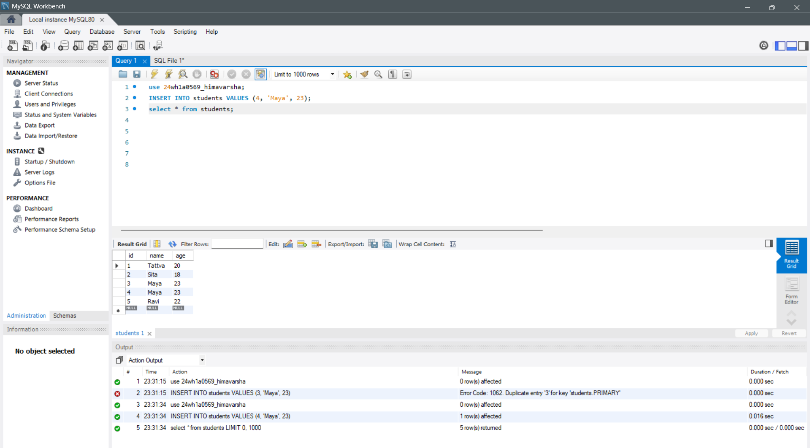
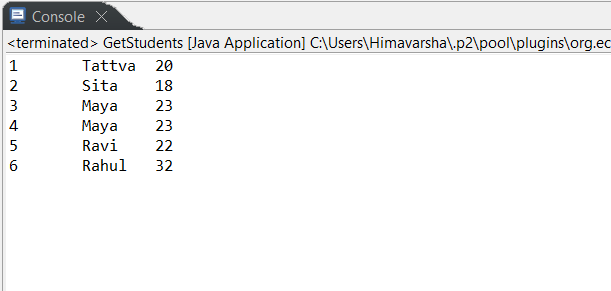
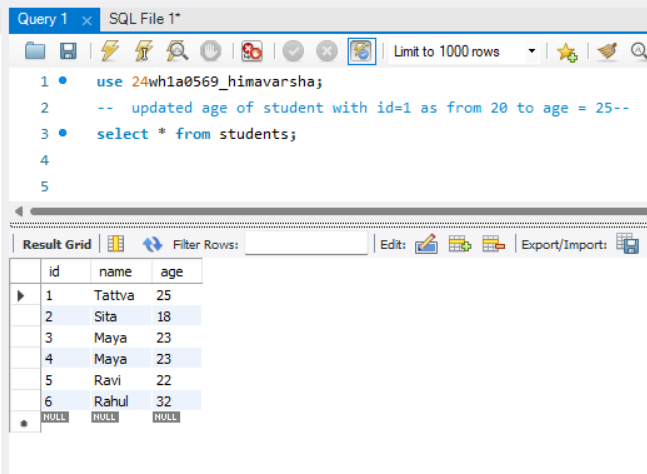
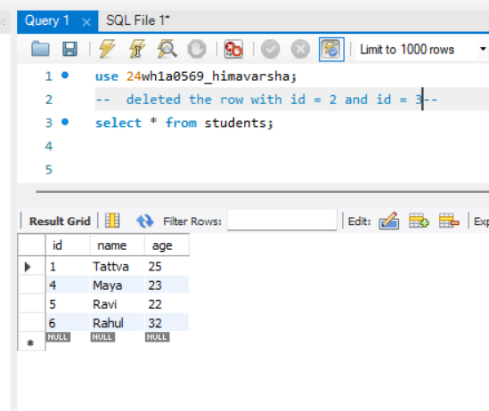

# JDBC CRUD Operations

This project demonstrates CRUD operations using Java and MySQL.

## Programs
- InsertStudent.java → Insert data into database
- GetStudents.java → Retrieve data
- UpdateStudent.java → Update records
- DeleteStudent.java → Delete records

## Tools Used
- Java
- JDBC
- MySQL

## Output
Each program performs one CRUD operation on the students table.

### Insert Operation

### Read Operation

### Update Operation

### Delete Operation

